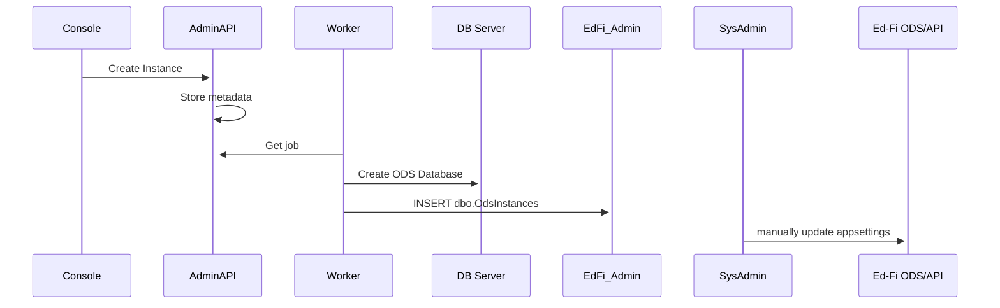

# Admin Console - Instance Management Worker Process

## Overview

The Admin Console provides comprehensive management of ODS/API instances, enabling seamless creation, duplication, and deletion of underlying database instances. Building on the foundational functionality of the Tech Console and original project, the Instance Management Worker Process will handle commands for instance creation, duplication, and deletion and for Postgres and Microsoft SQL Server databases, as our platform supports today.  This use case has been covered by the [Sandbox Admin library](https://github.com/Ed-Fi-Alliance-OSS/Ed-Fi-ODS/tree/main/Application/EdFi.Ods.Sandbox) in the past to accommodate similar operational needs for the Ed-Fi technology stack.  To meet field demand and requests, Admin Console needs to replicate instance management with "push button-like" functionality, to allow for easy and reliable administration of robust, multi-tenant environments to serve the at-scale growth of Ed-Fi technology and accommodate the multiple contexts that the open-source Ed-Fi technology stack operates in.

## Use Case Examples

* An educational service center (ESC) IT administrator would like to create *x* new instances she manages for her districts.  She will create this by using a user interface and understand the status of instance creation as the new databases come online.
* The IT administrator would like to copy of these instances for test data within the same tenant for off-hours performance testing and debugging.  The IT administrator would like to delete *y* of these instances once the testing is complete.
* The IT administrator would like to have day-to-day understanding of the operation of the ESC's instances, which the Instance Management Worker Process may return basic instance status data (online/offline, instance size and other attributes, for example) for that understanding and displayed in Admin Console.

## Requirements

* The Instance Management Worker Process must run in the environments are
  community demands: Windows Server and Docker/Linux platforms.
* The Instance Management Worker Process must be compatible with our major
  cloud platforms as used in today's education architectures:  Azure and AWS primarily, and with considerations for GCP.  Also many of today's education architectures run on-premise, so Windows Server must be a primary consideration.  Lastly, developers must be able to run this in their development environments, which Docker is the preferred method to launch and work within those scenarios. 
* The Instance Management Worker Process must be compatible with both Microsoft
  SQL Server and Postgres database types.
* This will be runnable in both Windows and Docker/Linux environments to fit our operational environments.  To meet this requirement, the implementation will be will be a .NET Core C# CLI command-line executable and follow practice example from other services for task-running.  Choosing a command-line executable will allow privileged operations to occur in a contained context and prevent  the web application from having to execute these operations in a less-ideal security context. 
* This command-line application is supportive of a distributed architecture, and encapsulated to specific set of functionality ("instance management"), it has independence from other services and decoupled ("no Ed-Fi shared libraries"), it will be stateless ("relying on state data within Admin API") and will use standard communications protocols ("HTTPS").  The command-line service provides the implementor varies ways to call and schedule the service (Windows Scheduler, `docker exec` and other methods), however defers additional concerns like HTTP hosting and service/user authentication within the service, preferring that the implementor defines how the service is called according to their operational environment.
* The Instance Management Worker Process will provide create, rename, copy, delete and other database administrative functions common to managing multi-tenant environments.
* The Instance Management Worker Process must be used responsibly by organizational guidelines, and operated by experienced IT professionals who are familiar with securing multi-tenant environments. It automates server operations, which may have cost impact or other major impacts on IT environments.  Documentation must be provided in how to use and configure the Instance Management Microservice and with security considerations in mind to meet organizational guidelines & industry best practices.  We may want to require manual configuration of the Instance Management Worker Process  in reference configurations, to ensure experienced IT professionals are intentionally enabling the service, given it's ability to automate server functions.

## Design

### Definitions 

**Educational service center (ESC)**  - a regional organization that provides shared IT services, such as technology support, infrastructure, and software solutions, to multiple school districts within its network.

**Ed-Fi Instance** - a central data hub where education data lives securely to enable analytics and other use cases.  Typically is physically instantiated as a PostgreSQL or Microsoft SQL database; however as could found instantiated as Amazon Relational Database Service (RDS), Azure Database or GCP Cloud SQL cloud-hosted service.

### Process Sequence Diagram

Below are process diagrams to describe how instances are managed by the Instance Management Worker Process. 

#### Create Instance

Below is a Mermaid process diagram to describe the "create instance" operation for the Instance Management Worker Process.

### Operations

Below are the abstract operations that will be defined by Instance Management Worker Process and a summary of the operation it will cover.  Underlying in implementation, each database instance has methods to implement these abstract operations, which definition will be left to individual provider implementation.

* **AddInstance** - add an Ed-Fi instance within the context of the running environment (i.e. database server, on-premise or cloud-hosted service, etc).  This typically means: adding a new database on a database server, creating the selected Ed-Fi data model within that database and optionally populating it with descriptor sets and/or sample data.  This operation must allow for custom naming of databases by a string provided by the calling application.  Common naming conventions are likely to be per school districts, per school year, per environment (dev/staging/production) and/or other and a combination of these parameters in the regional service center.  The *AddInstance* operation should allow for long naming conventions and the two spacing special characters, dash and underscores.
  * Consider:
    * Adding methods for bulk creation of Ed-Fi instances, such as 5 at a time, so the application doesn't have to repeatedly call the API serially for known bulk creation needs.
    * If a bulk creation method is added to *AddInstance*, such as by an optional integer parameter, then too consider limiting the number of instances that could be created by configuration (i.e. "20" as the maximum number of databases to be created) to safeguard against runaway or accidental bulk creations (i.e. "2000" when an ESC only has 10 districts).
* **CopyInstance** - copy an existing Ed-Fi instance, allow for setting a custom instance name and copy the underlying data from the host instance into the clone copy, and ensure that the database is brought online, successfully; otherwise report back an error.
* **RenameInstance** - rename an existing Ed-Fi instance, allow for setting a custom instance name and ensure that the database is brought online, successfully; otherwise report back an error.
* **DeleteInstance** - delete an existing Ed-Fi instance and ensure the database is successfully gone and offline; otherwise report back an error.
  * Consider:
    * Deleting a database is a destructive operation and may result in the unintended loss of data in production scenarios.  Consider feature flagging the delete ability so that implementors can decide if this operation is supported or not, as an additional safety.
* **InstanceInfo** - provide metadata information, such as database size and other available server information, to give operational information back to the calling application.
* **InstanceStatus** - provide server instance status information, such as online, offline, recovering, etc, to give operational information back to the calling application.

Examples of PostgreSQL and Microsoft SQL server commands as basis for the instance operation.  These commands should be generally available on on-premise and cloud hosted instances, and with implementation specific variables:

| Operation        | PostgreSQL                                                   | Microsoft SQL                                                |
| ---------------- | ------------------------------------------------------------ | ------------------------------------------------------------ |
| *AddInstance*    | `CREATE DATABASE new_database;`                              | `CREATE DATABASE new_database;`                              |
| *CopyInstance*   | `CREATE DATABASE new_database_name TEMPLATE existing_database_name;` | `BACKUP DATABASE existing_database_name TO DISK = 'C:\path\to\temp_backup.bak';` `RESTORE DATABASE new_database_name FROM DISK = 'C:\path\to\temp_backup.bak' WITH MOVE 'existing_database_data' TO 'C:\path\to\new_database_data.mdf', MOVE 'existing_database_log' TO 'C:\path\to\new_database_log.ldf';` |
| *RenameInstance* | `ALTER DATABASE old_database_name RENAME TO new_database_name;` | `ALTER DATABASE old_database_name MODIFY NAME = new_database_name;` |
| *DeleteInstance* | `DROP DATABASE database_name;`                               | `DROP DATABASE database_name;`                               |
| *InstanceInfo*   | `SELECT pg_size_pretty(pg_database_size('database_name')) AS size;` | `USE database_name; EXEC sp_spaceused;`                      |
| *InstanceStatus* | `SELECT datname AS database_name,        numbackends AS active_connections FROM pg_stat_database;` | `SELECT name AS database_name, state_desc AS status FROM sys.databases;` |

### Interface and Implementation Example

The [EdFi.Ods.Sandbox](https://github.com/Ed-Fi-Alliance-OSS/Ed-Fi-ODS/tree/main/Application/EdFi.Ods.Sandbox), a library that provides similar instance management in a sandbox capacity for developers and state agencies, provides good pattern implementation example of creating,  

Recommendations for interface and structure below for abstract, base and object classes, to be applied to the Instance Management Microservice:

* **IInstanceProvisioner.cs** - abstract interface definitions for operations listed above, such as *AddInstance*, *CopyInstance*, *DeleteInstance*, *RenameInstance* and *InstanceStatus*.  Each provisioner must implement these methods in the actual implementation for the particular database or storage strategy, and support using the local commands of its server or host environment.
* **InstanceProvisionerBase.cs** - a base class to define command elements like connection and other core variables.
* **InstanceStatus.cs** - an object class to hold the values of instance status, such as "ERROR".

Recommendations for out-of-the-box implementations for Admin Console 1.0 release, which should support Docker and Windows configurations:

* **PostgresInstanceProvisioner.cs** - The Postgres implementation to use PostgreSQL Data Definition Language (DDL) functions to carry out instance management operations.
* **SqlServerSandboxProvisioner.cs** - The SqlServer implementation to use MS-SQL Data Definition Language (DDL) functions and DBCC commands to carry out instance management operations.

Future considerations and for Ed-Fi and/or community source code contributions:

*  As cloud instances typically serve hosted full databases, similar to the instances managed above.  The classes above should have similar, if not matching operations, with the same server product targeted (i.e. - the classes above may work out-of-the-box for similar cloud hosted technology).  However, if the cloud platforms need additional customization to support instance operations, specific cloud provider classes would be used:
  * **Amazon** - AmazonRDSPostgresInstance.cs and AmazonRDSMSSQLInstance.cs
  * **Azure Database** - AzureRDSPostgresInstance.cs and AzureRDSMSSQLInstance.cs
  * **GCP Cloud SQL cloud-hosted service** - GCPCloudSQLPostgreInstance.cs and GCPCloudSQLMSSQLInstance.cs
* It's possible that other DevOps technologies could be supported for instance management in this model, as long as the core operations are supported.  TerraFormPostgreInstance.cs may be possible to automate TerraForm configuration to achieve similar needs, based on IT environment requirements.

### Technical Requirements

* .NET Core 8 C# CLI command-line executable, in parity with our other .NET technology, and known to run in Windows and Docker/Linux environments.
* The worker process should take a plug-in approach for the provisioners above, which will offer flexibility in how the microservice could be implemented, based on local IT environment needs.
  * Consider:  leaving no default configuration in Docker Deployment, to force the end user to only enable the Instance Management Worker Progress based on use case need, if security considerations are a concern.

### Service Dependencies

The Instance Management Service depends on the following services:

* **ODS / API 7.x** - this is the core Platform where instances are managed, and 7.x in particular has multi-tenant and multi-instance support for the API server.
* **Admin API** - this is an administrative API that contains information about ODS / API instances and hosts `/adminconsole` endpoints to allow with state management of instance operation.
* **Admin Console** - this is the UI application that will surface information from Admin API and allow for the control and automation of the Instance Management Worker Progress.
