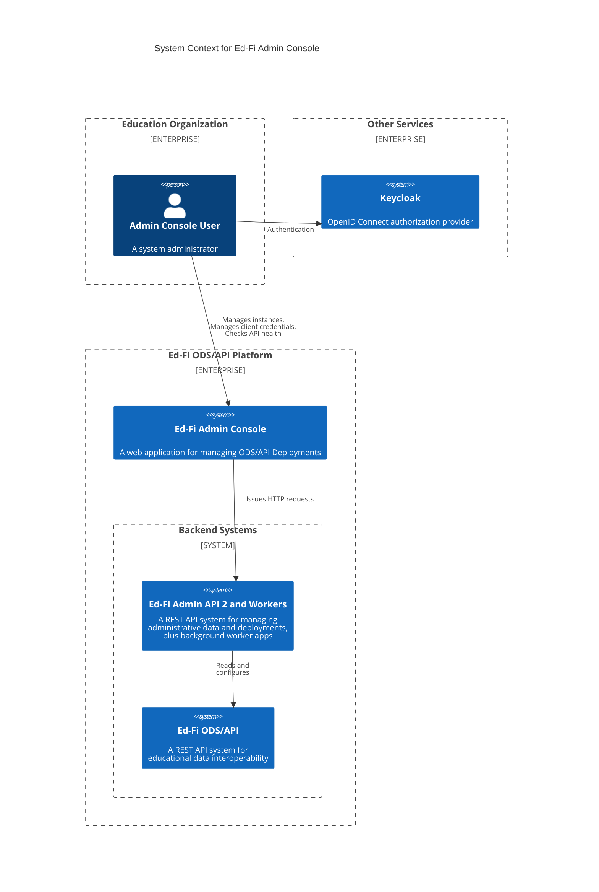

# Ed-Fi Admin Console 1.0 Testing Strategy

## Introduction

This document outlines the test strategy for release of Admin Console 1.0,
including the related applications required to support the Admin Console
functionality. The goal is to ensure the quality, reliability, and performance
of the Admin API and its interactions with the Admin Console and associated
worker applications.

## Context

The following C4 Context diagram depicts the systems and relationships covered
by this testing strategy. Below it are sub-sections summarizing the
functionality for each application.

### ODS/API

The ODS/API is a REST API application for system-to-system exchange of
educational data. The administrative tooling described below exists to support
deployment and operation of the ODS/API.

Testing with the ODS/API will be limited to the integration points with the
system described in this document. The following ODS/API versions need to be
tested with this solution: 7.1, 7.2, and 7.3.

### Admin Console

The Admin Console is a web-based user interface. In version 1.0, its primary
functionality includes:

* Management of ODS/API client credentials.
* Deployment of ODS database instances.
* Health check monitoring of ODS/API instances.

Only one user role will be included in 1.0, that of a system administrator who
is allowed to take all available actions. Multiple system administrator users
can be created for a given Admin Console deployment.

> [!WARNING] SF notes to self
>
> * I need to review what we decided about multi-tenancy, and management of
>   additional copies of the Admin and Security databases.
> * Do we need to cover the SDK in this document?

### Admin API

Admin API is a REST API application that will serve as the Backend-for-frontend
(BFF) supporting Admin Console. In other words, the Admin Console will retrieve
all necessary data from Admin API.

Additionally, Admin API will provide data management for the two worker
processes described below.

### Instance Management Worker

This is a command line application that runs on a schedule. It supports
creation, deletion, and renaming of ODS database instances. These are discrete
databases on a given server. The ODS/API auto-discovers the list of available
instances and uses URL routes to shunt incoming HTTP traffic to the correct
database instance.

> [!WARNING] SF notes to self:
>
> * Multi-tenancy?
> * Does the ODS/API look these up automatically, and is there a wait time? Or
>   do we need to restart?

### Health Check Worker

This is a command line application that runs on a schedule. It queries all of
the instances created for a given ODS/API runtime, checking (a) for uptime of
the ODS/API itself and (b) reporting document counts for a small number of Ed-Fi
API resources (e.g. students).

> [!WARNING] SF notes to self:
>
> * Multi-tenancy?

#### Keycloak

Keycloak is a third-party, open source, component that serves as an Open ID
Connect compatible _identity provider_ (IdP). This test strategy will only cover
the integration points between the Ed-Fi system and Keycloak; for example, we
will not perform detailed functional or useability testing of Keycloak.

Admin API also has a legacy, internal, authentication system. That system is
being kept for backwards compatibility with automation scripts that work
directly with the Admin API. The Admin Console only supports use of Keycloak for
authentication.

> [!WARNING] SF notes to self:
>
> * Roles
> * Scopes

#### Database Management Systems

These systems will support both PostgreSQL and Microsoft SQL Server running on
"bare metal", in a VM or as a Docker container. These three configurations are
functionally equivalent, and most testing will occur within Docker containers.

While other recent versions of the applications will likely work out of the box,
the Ed-Fi Alliance's testing process will only include the following versions:

* PostgreSQL 16
* Microsoft SQL Server 2022

## Testing Approach

The Ed-Fi Alliance will provide both static and dynamic testing of the Admin
Console and related applications. Static testing includes both human and
automated review of work products. Dynamic testing will include both functional
and non-functional testing approaches, as described in more detail in the
sections below.

The development team building the Ed-Fi Admin Console operates on two week
sprints, with small work items that can be integrated into the `main` branch of
code in a matter of days. Frequent integration of code helps to avoid errors and
provides opportunities for continuous static testing and continuous operation of
automated dynamic tests. Code integration occurs through GitHub using [Pull
Requests](https://docs.github.com/en/pull-requests). No developer is able to
merge code into the `main` branch, from whence releases are created, without
passing through the pull request review process.

> [!WARNING] SF notes to self:
>
> * When will we execute full manual / regression testing? Not with every pull
>   request of course. But when?

### Static Testing

Static testing first occurs through peer review of design documents, application
source code, and test cases. In written documents, this peer review process
promotes:

* Clarity and consistency in functional descriptions and translation to design.
* Identification of gaps in documentation or design plans.
* Consistent use of terminology.
* Adherence to [Ed-Fi coding
  standards](https://docs.ed-fi.org/community/sdlc/code-contribution-guidelines/coding-standards/).

In addition, the Alliance uses the following tools to automate static testing at
the level of source code:

1. [sonar-dotnet](https://github.com/SonarSource/sonar-dotnet), which analyzes
   code against 470+ C# rules covering know vulnerabilities, bugs, security
   hotspots ,and code smells.
   1. The application source code tunes some of the default rules to comply with
      the Ed-Fi C# Coding Standard.
   2. All warnings are treated _as errors_.
   3. Code that contains errors (including "warnings") does not pass the review process.
2. [GitHub CodeQL](https://codeql.github.com/) provides advanced semantic
   analysis that searches for potential security vulnerabilities in a code base.
3. [Github
   dependency-review-action](https://github.com/actions/dependency-review-action)
   detects new .NET package dependency vulnerabilities during the pull review
   process, and [GitHub
   Dependabot](https://docs.github.com/en/code-security/dependabot/working-with-dependabot)
   detects runs nightly to detect vulnerabilities in the packages that are
   already in use.

These review processes, except for Dependabot, occur for every pull request.

> [!WARNING] SF notes to self:
>
> * Periodic review of code coverage to make sure we don't have gaps on important
>   functionality.
> * Is 80% the right number? Are we going to enforce that automatically or
>   through periodic review?

## Functional Testing

Our functional testing approach includes the following levels of testing:

### Unit Testing

Isolated code-level tests without external dependencies.

* Automation: Fully automated and integrated with the source code.
* Tools: NUnit
* Coverage: Minimum 80% code coverage.
  * Typical exceptions in the 20% include:
  * HTTP handlers ("controller")
  * ORM layer ("repository")
  * Minimize business logic in these layers so that business logic can be
  fully tested.
* Scope:
  * Admin API
  * Instance Management Worker
  * Health Check Worker
* Out of Scope:
  * Admin Console

    > [!NOTE]
    > Unit tests in the Admin Console web application code may be added in a
    > future release.

### Integration Testing

Code-level tests that include integration with external resources (e.g.,
database servers).

* Automation: Automated where feasible.
* Tools: NUnit
* Coverage: not determined
* Scope:
* Out of Scope:

### System Testing

Tests that interact with the entire installed  application. Also known as
end-to-end or E2E tests.

* Automation: Automated when possible.
* Tools: Postman, Playwright
* Coverage: to be determined

  > [!NOTE]
  > Calculating coverage means we need to identify test cases and then
  > determine what percentage of them are covered by the Postman tests. This
  > is a manual process.

* Scope:
  * Admin API
* Out of Scope:
  * Admin Console

For both _System_ and _System Integration_ tests: manual testing will be
required for more complex scenarios, with a goal to increase automation over
time.

### System Integration Testing

Full spectrum (true E2E) tests covering interactions between the multiple
applications.

* Automation: to be determined
* Tools: to be determined
* Scope: all applications in the ecosystem.

## Non-Functional Testing

> [!WARNING]
> 
> The sections below were created by Microsoft 365 Copilot and with very little
> editing applied yet.

### Performance Testing

Ensure the system performs well under expected and peak loads.

* Types: Load testing, stress testing, and scalability testing.
* Tools: JMeter, LoadRunner, Gatling.

### Security Testing

* Objective: Identify vulnerabilities and ensure the system is secure against attacks.
* Types: Penetration testing, vulnerability scanning, and security code reviews.
* Tools: OWASP ZAP, Burp Suite, Nessus.

### Usability Testing

* Objective: Ensure the application is user-friendly and meets the needs of its users.
* Methods: User interviews, A/B testing, and heuristic evaluations.
* Tools: UserTesting, Hotjar, Crazy Egg.

### Compatibility Testing

* Objective: Ensure the application works across different devices, browsers,
  and operating systems.
* Types: Cross-browser testing, cross-device testing.
* Tools: BrowserStack, Sauce Labs, CrossBrowserTesting.

### Accessibility Testing

* Objective: Ensure the application is accessible to users with disabilities.
* Standards: WCAG (Web Content Accessibility Guidelines).
* Tools: Axe, WAVE, Lighthouse.

### Data Integrity Testing

* Objective: Ensure data is accurately stored, retrieved, and maintained.
* Methods: Data validation, data migration testing.
* Tools: Custom scripts, database testing tools.

### Continuous Integration/Continuous Deployment (CI/CD) Testing

* Objective: Integrate testing into the CI/CD pipeline to catch issues early.
* Practices: Automated testing, continuous monitoring.
* Tools: Jenkins, GitLab CI, CircleCI.

### Monitoring and Logging

* Objective: Monitor the application in production to catch issues early.
* Practices: Real-time monitoring, log analysis.
* Tools: Splunk, ELK Stack, Prometheus.

## Implementation

### Test Environment Management

* Objective: Ensure consistent and reliable test environments.
* Practices: Environment provisioning, configuration management.
* Tools: Docker, Kubernetes, Terraform.

### Test Case Management and Reporting

* Work Item Tickets: Enter comments on individual work item tickets for unit and
  integration tests.
* System and Integration Tests: Record test plans and execution results in a
  document or spreadsheet for better tracking and visibility.

### Test Data Management

* Objective: Ensure the availability of relevant and realistic test data.
* Practices: Data masking, synthetic data generation.
* Tools: Delphix, TDM tools.

## Test Case Development

Specific Testing Areas for Admin API

* Tenant Management: Ensure CRUD operations for tenants are tested.
* ODS Instances Management: Validate create, read, update, and soft delete
  operations.
* Instance Management Worker: Test the creation, renaming, and deletion of ODS
  database instances.
* Health Check Worker: Verify the retrieval and storage of record counts from
  the ODS/API.

## Conclusion

This test strategy aims to ensure comprehensive coverage and high-quality
delivery of the Admin API to support the Admin Console. Continuous improvement
and feedback will be incorporated to enhance the testing process.
