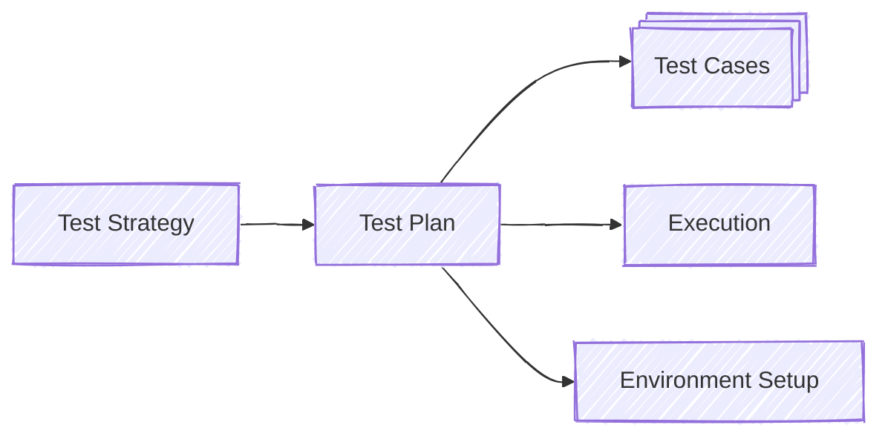

# Admin Console Platform Testing

Testing for Admin Console starts with a [Test Strategy](./STRATEGY.md) that
describes the aims and general approaches for testing the Admin Console web
application and other components it depends on - Admin API 2, Instance
Management Worker, and Health Check Worker. This document also summarizes the
features and functionality, and includes detailed diagrams of the various
components.

From this strategy, we devise (and revise, as needed) concrete plans for testing
each component. These individual test plans include detailed test cases covering
the functional, useability, and performance testing.

The test planning process also helps us develop notes on how to setup consistent
[testing environments](./ENVIRONMENT.md), and how to [execute the
tests](./EXECUTION.md), including recording test results.

Component test plans:

* [Admin Console](./admin-console/README.md)
* [Admin API 2](./api/README.md)
* [Health Check Worker](./health-worker/README.md)
* [Instance Management Worker](./instance-mgmt/README.md)