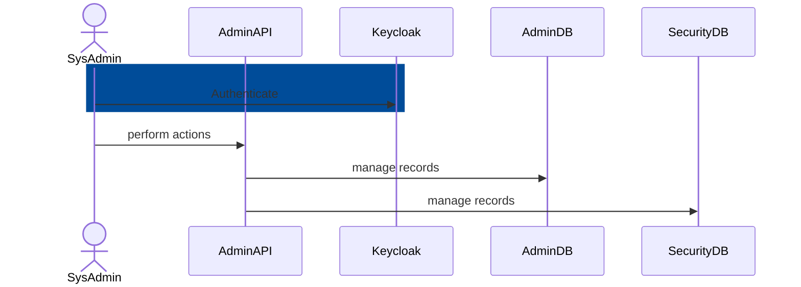
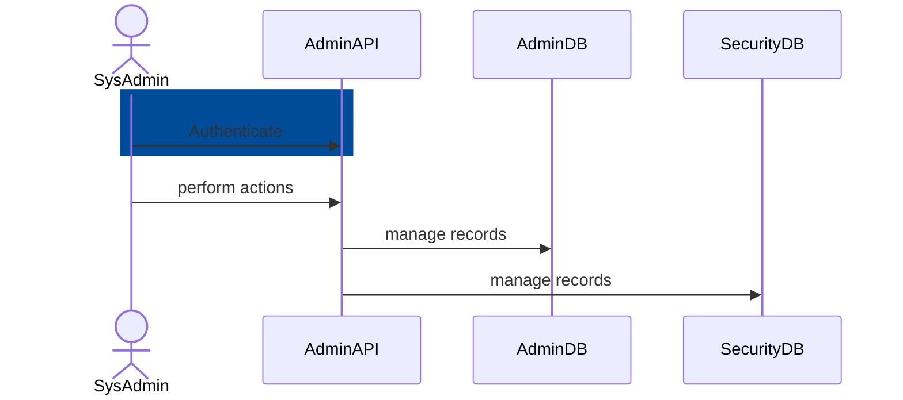
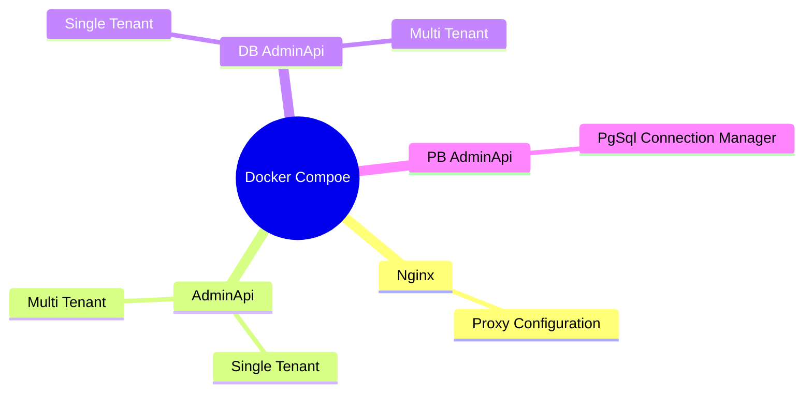

# Admin Console 1.0 Test Plan: Admin API 2.3

## Context

For the purposes of this test plan, Admin API 2 will be considered an isolated
system. That is, interactions with Admin Console, Instance Management Worker,
and the Health Check Worker will be tested in the context of those other
applications' test plans. The following sequence diagram therefore does not
include the other applications.

### Keycloak Identity Provider Mode

### Self-Hosted Identity Provider Mode

## Functional Testing

### Static Analysis

The Alliance uses Sonar-dotnet, GitHub CodeQL, GitHub dependency-review-action,
GitHub Dependabot, and Trivy to automate static testing and detect
vulnerabilities in the source code and Docker images. All warnings are treated
as errors, ensuring thorough security analysis and compliance with the Ed-Fi C#
Coding Standard.

### Unit

Admin API 2 will have unit tests covering all business logic.
As a .NET application, the test project will utilize the following tools:

* NUnit as the test framework.
* FakeItEasy for mocking.
* Shouldly for assertions.

Unit tests should not interact with Admin API or with the relational database
system.

These tests will run on every pull request in GitHub.

### Integration

Integration tests using sample `EdF_Admin` and `EdFi_Security` databases are
written as C# project using the same tools as the Unit tests. These tests cover
basic interaction with the relational database server, and they run
automatically on all pull requests in GitHub. A failing test prevents merge of
the modified code.

#### Integration Test Cases - Happy Path

> [!WARNING]
> To be documented elsewhere? Need to pull from existing C# test suite
> and possibly identify other tests cases. We might not be able to implement
> all documented test cases. Need to establish the expected coverage level.

#### Integration Test Cases - Negative

> [!WARNING]
> To be documented elsewhere? Need to pull from existing C# test suite
> and possibly identify other tests cases.

### System

System tests for Admin API 2 are written in Postman. These tests connect to
fully-functional `EdF_Admin` and `EdFi_Security` databases, and they run
automatically on all pull requests in GitHub. A failing test prevents merge of
the modified code.

#### System Test Cases - Happy Path

> [!WARNING]
> Consider the needs of both auth mechanisms. May need to create a smaller
> test suite with Keycloak integration. These tests now run without keycloak authentication.

| | Endpoints | Status | Validation Schema |
|---|---|---|---|
| GET  | `\UserProfile` | 200  | Yes |
| POST | `\UserProfile` | 200  | Yes |
| GET  | `\UserProfile\{tenantId}\{id}` | 200  | Yes |
| GET  | `\UserProfile\{tenantId}` | 200  | Yes  |
| GET  | `\Tenants` | 200  | Yes |
| POST | `\Tenants` | 200  | Yes |
| GET  | `\Steps` | 200  | Yes |
| POST | `\Steps` | 200  | Yes |
| GET  | `\Permissions` | 200  | Yes |
| POST | `\Permissions` | 200  | Yes |
| GET  | `\Permissions/\{tenantId}\/{id}` | 200  | Yes |
| GET  | `\Permissions/\{tenantId}` | 200  | Yes  |
| POST | `\HealthCheck` | 200  | Yes |
| GET  | `\HealthCheck` | 200  | Yes |
| GET  | `\HealthCheck\{tenantId}` | 200  | Yes  |

#### System Test Cases - Negative

| | Endpoints | Status | Validation |
|---|---|---|---|
| GET  | `\UserProfile` | 400  | Invalid Path |
| POST | `\UserProfile` | 400  | Invalid Body |
| GET  | `\UserProfile\{tenantId}\{id}` | 400  | Invalid Tenant Id |
| GET  | `\UserProfile\{tenantId}\{id}` | 400  | Invalid Id |
| GET  | `\UserProfile\{tenantId}` | 400  | Invalid Tenant Id |
| GET  | `\Tenants` | 400  | Invalid Path |
| POST | `\Tenants` | 400  | Invalid Body |
| GET  | `\Steps` | 400  | Invalid Path |
| POST | `\Steps` | 400  | Invalid Body |
| GET  | `\Permissions` | 400  | Invalid Path |
| POST | `\Permissions` | 400  | Invalid Body |
| GET  | `\Permissions/\{tenantId}\/{id}` | 400  | Invalid Tenant Id |
| GET  | `\Permissions/\{tenantId}\/{id}` | 400  | Invalid Id |
| GET  | `\Permissions/\{tenantId}` | 400  | Invalid Tenant Id |
| POST | `\HealthCheck` | 400  | Invalid Path |
| GET  | `\HealthCheck` | 400  | Invalid Body |
| GET  | `\HealthCheck\{tenantId}` | 400  | Invalid Tenant Id |

#### System Test Execution

Currently the entire testing environment is created in Docker.

### System Integration

Complete system integration testing is covered in the [Admin
Console](./PLAN-console.md) test plan document.

## Non-Functional Testing

### Performance Testing

API performance will be tested using the Locust toolkit (Python-based). It is
not necessary to perform heavy load testing of all endpoints. Locust provides
a random distribution of executions against defined endpoints.

#### Performance Test Cases

The testing will focus on those endpoints with the most business logic, for
example:

1. `GET /v2/claimSets/export`
2. `POST /v2/claimSets/import`
3. `POST /v2/applications`
4. `POST /v2/claimSets/{claimSetId}/resourceClaimActions/{resourceClaimId}/resetAuthorizationStrategies`

##### Performance Test Execution

Utilize the same scripts / Docker environment used for supporting System
testing. Details of how to execute Locust, for how long to run tests, etc., are
to be determined once someone begins working on this performance testing.

### Operational Useability Testing

Heuristics worksheet to be developed.

Performed by the support team rather than the development team, in coordination
with Ed-Fi Customer Success.

#### Operational Test Cases

1. Unable to connect to destination database. The database server must be
   running for Admin API to work and provide information to the worker. Try
   running the worker from the container host OS or in an alternate Docker
   network, so that it can (a) access Admin API but (b) cannot access the RDBMS.
2. Keycloak is down - cannot lookup RSA public key for signature verification.
3. AdminApi cannot start due to missing configuration in SIGNING_KEY
4. It is not possible to register users because the AllowRegistration flag is disabled.
5. It is not possible to consume any endpoint due to a misconfiguration of the tenants.