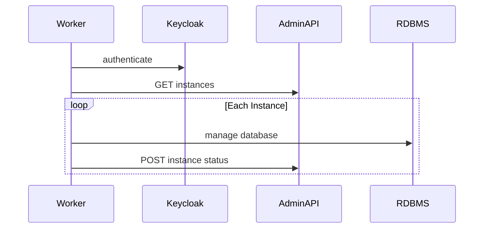

# Admin Console 1.0 Test Plan: Instance Management Worker

## Context

The following sequence diagram summarizes the interactions between systems. For
more detail, see the [Instance
Management](https://github.com/Ed-Fi-Alliance-OSS/AdminAPI-2.x/blob/main/docs/design/adminconsole/INSTANCE-MANAGEMENT.md)
design document.

## Functional Testing

### Static Analysis

The Alliance uses Sonar-dotnet, GitHub CodeQL, GitHub dependency-review-action,
GitHub Dependabot, and Trivy to automate static testing and detect
vulnerabilities in the source code and Docker images. All warnings are treated
as errors, ensuring thorough security analysis and compliance with the Ed-Fi C#
Coding Standard.

### Unit

The Instance Management Worker will have unit tests covering all business logic.
As a .NET application, the test project will utilize the following tools:

* NUnit as the test framework.
* FakeItEasy for mocking.
* Shouldly for assertions.

Unit tests should not interact with Admin API or with the relational database
system.

These tests will run on every pull request in GitHub.

### Integration

This tool interacts with a database server for database creation, deletion, and
renaming operations. It also interacts with Admin API for receiving information
about what actions to perform.

Integration testing, as opposed to the System testing listed below, would select
a module or class that interacts with one of these systems. It would establish a
live link to a running system or a test harness simulation, and then execute
that module with the live link. This would cover aspects of the source code that
are not practical to unit test.

Integration testing of this form will not be performed in the current project.

### System

System testing runs the entire application, not just a specific module, with
live links to real or simulated external services. In addition, System testing
can include execution of the application in failure scenarios to test the error
handling.

Automated system testing should be performed in the scope of the current
project, time permitting. This will require starting a running instance of Admin
API and orchestrating appropriate scenarios.

#### System Test Cases - Happy Path

1. Create a new instance.
2. Rename an existing instance.
3. Delete an existing instance.
4. Create two instances at the same time.
5. Perform all three commands at the same time.

For each test case, ensure that:

1. The database instance is in the proper state (created, renamed, deleted).
2. Admin API has been updated correctly.
3. Exit code from the application is 0.

#### System Test Cases - Negative

1. Admin API is inaccessible.
2. Keycloak is inaccessible.
3. Admin API credentials are invalid.
4. The database server is inaccessible to the worker (but accessible to Admin
   API).
5. Create operation with a database name that already exists.
6. Rename operation on a database that is locked.
7. Delete operation on a database that is locked.

For each test case, ensure that:

1. Admin API, if it is running, has been updated with correct Failure status.
2. Exit code from the application is not zero.

#### System Test Execution

One possible approach, using a PowerShell script or C# project:

1. Start environment in Docker using Compose.
2. Run SQL script to setup initial state for the test case.
3. Start a timer.
4. Call `docker exec` to run the worker immediately, instead of waiting for
   schedule. Don't use `--rm` to remove, as we need the logs
5. When it comes back:
   1. Stop the timer
   2. Collect logs and write to disk
   3. Report the duration taken.
   4. Remove the "exec" container.
6. Stop the docker environment.

If using PowerShell, can use Pester to write assertions. Ideally, these tests
would run on pull requests.

### System Integration

Complete system integration testing is covered in the [Admin
Console](./PLAN-console.md) test plan document.

## Non-Functional Testing

### Performance Testing

Using the System Test framework, add the following test cases. These can be run
automatically or manually. Favor automatic execution if the timing is very
quick.

#### Performance Test Cases

1. Expected peak load: create five instances.
   1. Assert that the duration is less than 10 minutes.
2. Complex scenario:
   1. Pre-create four instances manually (simple `CREATE DATABASE` statements).
   2. Now inject five new creations, two deletions, and two renames.
3. Heavy load: create 2,000 instances.

### Operational Useability Testing

Heuristics worksheet to be developed.

Performed by the support team rather than the development team, in coordination
with Ed-Fi Customer Success.

#### Operational Test Cases

1. Admin API is not running.
2. Unable to connect to destination database. The database server must be
   running for Admin API to work and provide information to the worker. Try
   running the worker from the container host OS or in an alternate Docker
   network, so that it can (a) access Admin API but (b) cannot access the RDBMS.
